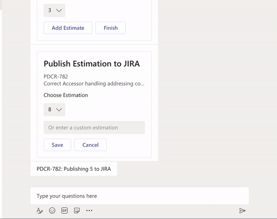

# SDK4 Teams Scrum Poker bot with Typescript

This is an scrum poker chatbot built on top of the Microsoft Bot Framework Node.JS SDK v4. It will support group conversation in a channel by mentioning the name of the bot and the ticket number of a JIRA ticket as well as a simple dialog to assist users in estimation of tickets.

Please create and adjust the .env file accordingly. 
The following env variables are required to write/read from JIRA :

**JIRA_SERVER_URL**= https address of the JIRA server, rest api version 2 endpoint should be accessible

**JIRA_AUTH_HEADER**=base64 basic auth username/password

**JIRA_ESTIMATION_CUSTOM_FIELD_NAME**= name of the custom field associated with estimation points
