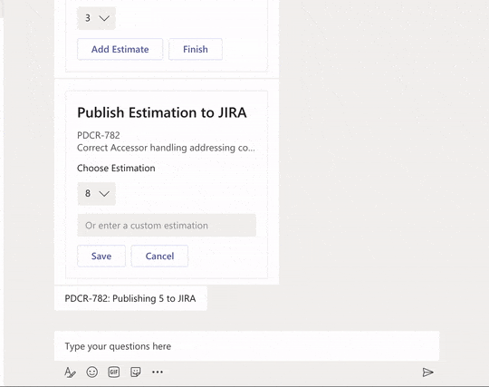

# SDK4 Teams Scrum Poker bot with Typescript

This is an scrum poker chatbot built on top of the Microsoft Bot Framework Node.JS SDK v4 to help with group ticket estimations. 
The main use-case is in a group-chat/channel setup, in which each of the remote participants will 
contribute to the ticket estimation without seeing each others estimations. It also has direct
integration with JIRA, therefore it can display the ticket summary and submit the ticket estimation directly to JIRA.

Please create and adjust the .env file accordingly. 
The following env variables are required :

**MICROSOFT_APP_ID**= The azure APP_ID from azure portal

**MICROSOFT_APP_PASSWORD**= registered APP_PASSWORD from azure portal

**ENV**=PROD

**JIRA_TICKET_PREFIX**= optional prefix the filter JIRA tickets

**JIRA_SERVER_URL**= https address of the JIRA server, rest api version 2 endpoint should be accessible

**JIRA_AUTH_HEADER**=base64 basic auth username/password

**JIRA_ESTIMATION_CUSTOM_FIELD_NAME**= name of the custom field associated with estimation points
